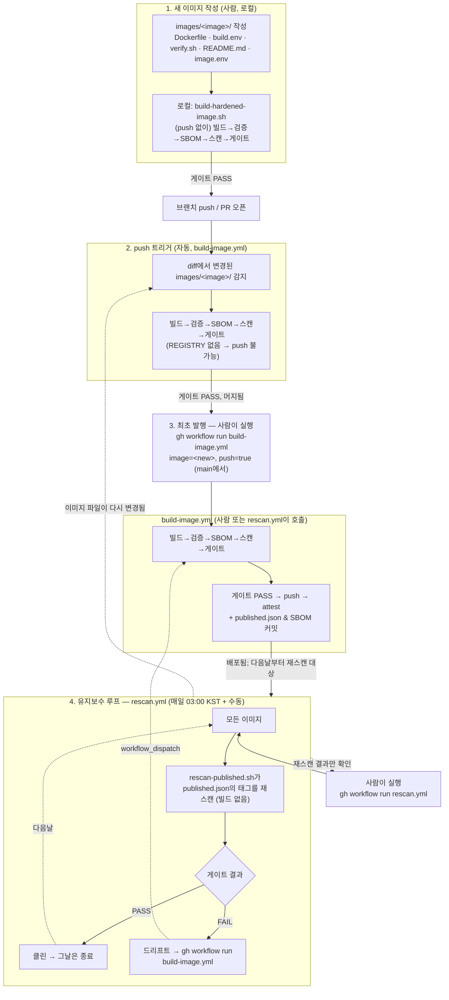

# 아키텍처와 빌드 파이프라인

[English](architecture.md) · 한국어

이 저장소의 목적은 **CVE가 0개인 컨테이너 이미지**를 만들고, 엄격하게 게이트를 통과시켜,
프로덕션에서 쓸 수 있도록 배포하는 것이다. "업스트림 이미지를 쓰다가 안 되면 그때만 직접
빌드한다"는 방식이 아니다. 엄격하게 통제된 **결정론적 하드닝 파이프라인**이 전제이자 유일한
작업 방식이며, 모든 이미지의 취약점을 0으로 만드는 것을 목표로 한다.

## 1. 아키텍처 철학

* **오케스트레이터는 하나뿐이다.** 단일 셸 스크립트
  `scripts/build/build-hardened-image.sh`가 모든 이미지의 파이프라인 전체 생명주기를
  제어한다.
* **독립적으로 동작한다.** 이 저장소는 특정 CI 시스템의 기능에도, 다른 저장소에도
  의존하지 않는다. 로컬이든 CI 러너든 `docker`와 `trivy`만 설치돼 있으면 동일하게
  동작한다.
* **SUSE BCI로 통일한다.** 애플리케이션 빌드는 업스트림과 최대한 가깝게 유지하되, 최종
  런타임 레이어(베이스 OS)는 SUSE BCI로 전면 교체해서 배포판 고유의 OS 취약점을 영구히
  제거한다.
* **결정론적 태깅.** `latest`처럼 계속 움직이는 태그는 허용하지 않는다. 배포되는 모든
  이미지는 `[버전]-security-hardened-[빌드일자]` 형태의 명시적 태그를 받는다.
* **지원되는 라인에 앉는다.** 여기서 "최신"은 최신 태그가 아니라 업스트림이 아직 보안
  패치를 제공하는 라인 중 가장 새로운 릴리스다. 이 정의는 앱마다 다르다 — PostgreSQL은
  메이저 다섯 개를 동시에 유지보수하지만, APISIX는 가장 새로운 마이너 하나만 유지보수해서
  새 마이너가 나오면 직전 마이너가 즉시 EOL 된다. 이미지별로 추적하는 라인은
  `images/<이미지>/image.env` 가 선언하고, 그 라인이 아직 유지보수 중인지는 일간
  rescan 이 확인한다. CVE 와 달리 EOL 은 리빌드로 해소되지 않으므로 — 같은 EOL 핀을 매일
  다시 빌드하게 될 뿐이다 — 이 검사는 드리프트→리빌드 경로와 분리돼 있고, 조치는 사람이
  핀을 옮기는 것뿐이다.
* **입력을 검증한다.** 빌드가 가져오는 모든 것을 검증한다 — git 소스는 커밋 SHA로,
  tarball은 커밋된 SHA256으로. TLS 검증을 끄는 일은 절대 없고, 검증되지 않은 원격
  스크립트를 셸로 파이프하는 일도 없다.
* **결과물을 검증 가능하게 만든다.** 배포되는 모든 이미지의 SBOM은 저장소에 커밋되고,
  배포되는 모든 다이제스트에는 빌드 provenance와 SBOM attestation이 붙는다 — 그래서
  소비자는 이 저장소의 로그를 신뢰하지 않고도 자신이 받은 것을 직접 확인할 수 있다.

---

## 2. 이미지를 추가하는 것부터 매일 유지보수하는 것까지

빌드 → 검증 → SBOM → 스캔 → 게이트 → 푸시는 단일 진입점 `build-hardened-image.sh` 안에서
순차적·원자적으로 실행되며, 실패하면 즉시 멈춘다(fail-fast). 이를 호출하는 유일한 CI
진입점은 `build-image.yml` 워크플로이며, 신규 이미지와 이미 배포된 이미지 사이에 다른
것은 **언제 호출하느냐**뿐이다. 배포된 이미지에 대해 언제 호출할지 결정하는 것은 별도의
워크플로인 `rescan.yml`의 역할로, 매일 재스캔하고 필요할 때만 `build-image.yml`을
호출한다 — 재빌드 로직 자체를 중복해서 만들지 않는다.

네 단계:

1. **새 이미지 작성 (사람, 로컬)** — 파일을 다 쓴 뒤, push하지 않고 로컬에서 빌드·검증하고
   게이트를 확인한다([image-authoring/README.md](image-authoring/README.md)의 신규
   이미지 체크리스트 참고 — 이 문서는 영문 단일본이다).
2. **`push` 트리거 (자동, `build-image.yml`)** — 브랜치를 push하면 변경된 이미지에 대해서만
   같은 파이프라인이 검증 전용 모드(레지스트리 push 불가능)로 다시 돈다. 포크에서 작업하는
   기여자는 자기 포크에서 이것을 자동으로 받는다. [image-authoring/ci.md](image-authoring/ci.md)
   참고.
3. **최초 발행 — 사람이 `build-image.yml`을 직접 실행** — 머지 후 `main`에서
   `push=true`로 실행하는 것이 `REGISTRY_HOST` 레지스트리에 최초로 push하고
   `published.json`의 첫 항목을 만드는 시점이다. 이때부터 "배포된 이미지"가 된다.
4. **유지보수 루프 — `rescan.yml` (매일 자동 + 수동)** — 배포된 이미지는 매일 재스캔된다.
   클린하면 아무 일도 일어나지 않고, CVE 드리프트가 발견되면 `rescan.yml`이 그 이미지에
   대해서만 `build-image.yml`을 호출해 재빌드·재배포한다(재빌드 로직 자체는 절대 중복되지
   않는다). [image-authoring/ci.md](image-authoring/ci.md)의 "일일 드리프트 점검" 참고.

---

## 3. 파이프라인 단계별 상세

### 1단계: 빌드

* **입력**: `images/<image>/<variant>.build.env`(버전과 인자), `<variant>.Dockerfile`
* **동작**: 설정된 변수(`APP_VERSION`, `TARGET` 등)를 읽어 `docker build`를 실행한다.
* **특징**: 빌드는 업스트림 자체 로직(빌더 스테이지)을 최대한 그대로 재사용하지만, 런타임
  베이스는 예외 없이 SUSE BCI로 교체된다. 빌드가 가져오는 모든 소스는 무결성 검증을
  거친다 — git은 커밋 SHA, tarball은 커밋된 SHA256으로.

### 2단계: 검증 (기능 스모크 테스트)

* **입력**: `images/<image>/verify.sh`
* **동작**: 방금 빌드된 이미지를 실행하고(스크립트는 호스트에서 실행된다) 기본 기능이
  정상인지 확인한다.
* **확인 항목**:
  * `--version`이 의도한 버전과 일치하는가.
  * root 없이 non-root로 정상 실행되는가.
  * `--help`와 기본 명령이 동작하는가.

### 3단계: SBOM

* **도구**: `trivy image --format cyclonedx` (`build-hardened-image.sh` /
  `rescan-published.sh` 안에서 호출됨)
* **동작**: 이미지에 어떤 패키지·라이브러리·의존성 모듈이 들어있는지 CycloneDX SBOM으로
  추출해 출력 디렉터리에 기록한다.

### 4단계: 스캔

* **도구**: `scripts/gate/scan-image.sh`
* **동작**: 추출된 SBOM에 대해 `trivy`를 호출해 모든 심각도의 취약점 목록을 JSON으로
  만든다.
* **특징**: 단순 스캔에 더해, trivy가 이 배포판 베이스를 실제로 스캔할 수 있는지를
  확인하는 자가진단(`CoverageProbe`)을 함께 수행한다.

### 5단계: 게이트

* **도구**: `scripts/gate/image-gate.py`
* **동작**:
  1. `CoverageProbe`가 `ok`인지 확인한다 — 발견 건수가 0인 것이 단지 스캐너가 그
     배포판을 읽지 못했기 때문인 거짓 음성을 걸러낸다.
  2. NVD와 벤더(SUSE) 등급을 교차 검증(`max(NVD, vendor)`)해서, 실효 심각도 기준
     CRITICAL 또는 HIGH가 하나라도 남아있는지 판단한다.
  3. 예외 목록(`cve-exceptions.json`)에 등록된 항목은 제외한다.
* **결과**: 위반이 하나라도 있으면 파이프라인을 멈추는 치명적 오류다. 이 게이트를 통과한
  이미지만 "CVE 0"으로 인정된다.

### 6단계: 푸시, attest, 기록

* **동작**: 게이트를 통과한 이미지만 저장소 변수 `REGISTRY_HOST`가 가리키는 레지스트리로
  push된다. push 실패는 경고가 아니라 오류다.
* **Attestation**: push가 성공하면, 이 저장소의 어떤 코드도 실행하지 않는 별도 잡이
  GitHub 빌드 provenance와 SBOM attestation을 그 이미지의 **다이제스트**에 붙인다.
* **후속 작업**: CI(`build-image.yml`)에서는 push된 태그와 다이제스트가
  `published.json`에 기록되고, SBOM은 그 실행이 끝난 뒤에도 남도록
  `sboms/<image>.cdx.json`에 커밋된다. 둘 다 쓰기 권한을 가진 별도 잡이 수행한다 —
  build 잡 자체에는 쓰기 권한이 없다.
