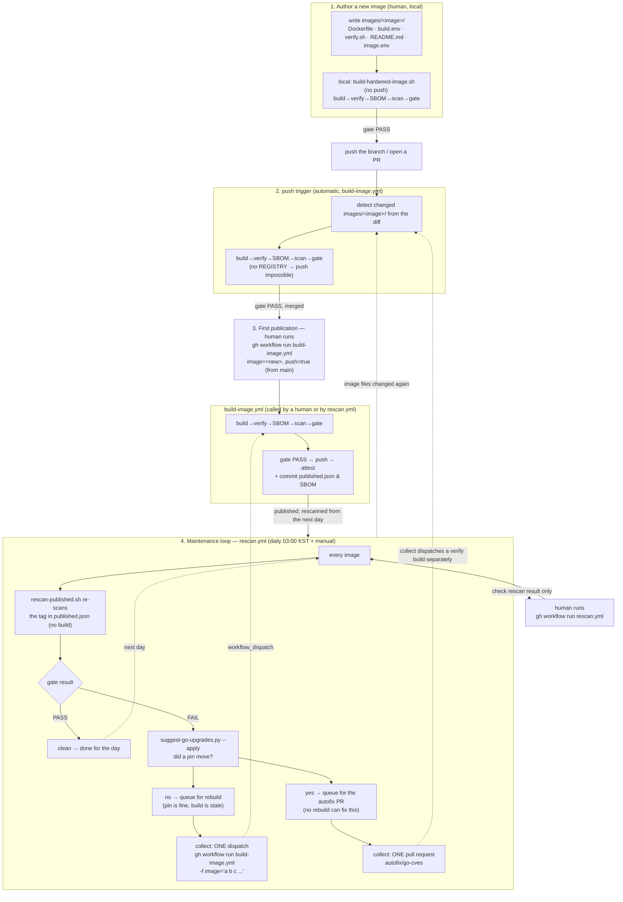

# Architecture and build pipeline

English · [한국어](architecture.ko.md)

The purpose of this repository is to produce **zero-CVE container images**, gate them
strictly, and publish them for production use. This is not "use the upstream image, and
build our own only when that fails". A tightly controlled **deterministic hardening
pipeline** is the premise and the only workflow: every image's vulnerabilities are
driven to zero.

## 1. Architectural philosophy

* **One orchestrator.** A single shell script,
  `scripts/build/build-hardened-image.sh`, controls the entire pipeline lifecycle for
  every image.
* **Self-contained.** This repository depends on no feature of a particular CI system
  and on no other repository. Locally or on a CI runner, it behaves the same as long as
  `docker` and `trivy` are installed.
* **Unified on SUSE BCI.** The application build stays as close to upstream as possible,
  while the final runtime layer (the base OS) is replaced wholesale with SUSE BCI,
  permanently removing distribution-specific OS vulnerabilities.
* **Deterministic tagging.** Rolling tags such as `latest` are not permitted. Every
  published image gets an explicit `[version]-security-hardened-[build-date]` tag.
* **We sit on a supported line.** "Latest" here means not the newest tag but the newest
  release on an upstream line that is still receiving security patches. That differs per
  project — PostgreSQL maintains five majors at once, while APISIX maintains only its
  newest minor, so a new minor puts the previous one straight into end-of-life. Each
  image declares the line it tracks in `images/<image>/image.env`, and the daily rescan
  checks whether that line is still maintained. Unlike a CVE, an EOL line is not
  resolved by rebuilding — that would just rebuild the same EOL pin every day — so this
  check is kept out of the drift→rebuild path, and the only remedy is a person moving
  the pin.
* **Verified inputs.** Everything the build fetches is verified — git sources by commit
  SHA, tarballs by committed SHA256. TLS verification is never disabled and no
  unverified remote script is ever piped into a shell.
* **Verifiable outputs.** Every published image's SBOM is committed to the repository, and
  every published digest carries build-provenance and SBOM attestations — so consumers can
  check what they pulled without trusting this repository's logs.

---

## 2. From adding an image to maintaining it daily

Build → Verify → SBOM → Scan → Gate → Push runs sequentially and atomically inside the
single entry point `build-hardened-image.sh`, and stops immediately on any failure
(fail-fast). The only CI entry point that calls it is the `build-image.yml` workflow —
**when** it is called is what differs between a new image and an already-published one.
Deciding when to call it for published images is the job of a separate workflow,
`rescan.yml`, which re-scans daily and calls `build-image.yml` when needed rather than
duplicating any rebuild logic.

The four stages:

1. **Author a new image (human, local)** — once the files are written, build, verify,
   and check the gate locally without pushing (see the new-image checklist in
   [image-authoring/README.md](image-authoring/README.md)).
2. **`push` trigger (automatic, `build-image.yml`)** — pushing the branch runs the same
   pipeline again for the changed images only, in verification-only mode where pushing to
   a registry is impossible. Contributors working in a fork get this automatically in
   their own fork; see [image-authoring/ci.md](image-authoring/ci.md).
3. **First publication — a human runs `build-image.yml` directly** — after merging,
   running it from `main` with `push=true` is what first pushes to the `REGISTRY_HOST`
   registry and creates the first `published.json` entry. From then on it is a "published
   image".
4. **Maintenance loop — `rescan.yml` (daily, automatic and manual)** — published images
   are re-scanned every day. If clean, nothing happens. Drift **splits in two**: if
   `suggest-go-upgrades.py --apply` cannot raise a pin, only the build is stale, so the
   image is queued for a **rebuild**; if it does raise one, no amount of rebuilding at the
   current pin will clear the CVE, so it is queued for the **autofix PR**. The `collect`
   job acts on both at once — rebuilds go out as **one dispatch carrying every image**
   space-separated, and raised pins as **one pull request** on `autofix/go-cves` (the
   rebuild logic itself is never duplicated). What verifies that PR is a `build-image.yml`
   run `collect` dispatches explicitly right after the push — not the push itself, since a
   push made with this job's own token deliberately does not trigger `build-image.yml`'s
   push trigger.

   Dispatching per image is what must not happen: `build-image.yml`'s concurrency group
   keeps only one pending run and **cancels** the rest — nine of eleven vanished that way
   on 2026-09-03. A **job** held back by the runner limit merely waits, losing nothing; a
   **run** held back by a concurrency group is cancelled. Aggregating therefore raises
   parallelism. See "daily drift check" in
   [image-authoring/ci.md](image-authoring/ci.md).

---

## 3. Pipeline phases in detail

### Phase 1: Build

* **Input**: `images/<image>/<variant>.build.env` (versions and arguments),
  `<variant>.Dockerfile`
* **Behaviour**: reads the configured variables (`APP_VERSION`, `TARGET`, …) and runs
  `docker build`.
* **Characteristic**: the build reuses upstream's own logic (builder stages) as far as
  possible, but the runtime base is unconditionally replaced with SUSE BCI. Every source
  the build fetches is integrity-checked — commit SHA for git, committed SHA256 for
  tarballs.

### Phase 2: Verify (functional smoke test)

* **Input**: `images/<image>/verify.sh`
* **Behaviour**: starts the freshly built image (the script runs on the host) and checks
  that basic functionality is intact.
* **What is checked**:
  * `--version` matches the intended version.
  * The image runs correctly as non-root, without needing root.
  * `--help` and the basic commands work.

### Phase 3: SBOM

* **Tool**: `trivy image --format cyclonedx` (invoked inside
  `build-hardened-image.sh` / `rescan-published.sh`)
* **Behaviour**: extracts which packages, libraries, and dependency modules the image
  contains as a CycloneDX SBOM, written to the output directory.

### Phase 4: Scan

* **Tool**: `scripts/gate/scan-image.sh`
* **Behaviour**: calls `trivy` against the extracted SBOM and produces the vulnerability
  list across all severities as JSON.
* **Characteristic**: beyond a plain scan, it runs a self-check (`CoverageProbe`) that
  confirms trivy can actually scan this distribution base at all.

### Phase 5: Gate

* **Tool**: `scripts/gate/image-gate.py`
* **Behaviour**:
  1. Checks that `CoverageProbe` reads `ok` — eliminating false negatives where zero
     findings merely means the scanner could not read the distribution.
  2. Cross-checks NVD against the vendor (SUSE) rating (`max(NVD, vendor)`) and
     determines whether even one effective CRITICAL or HIGH vulnerability remains.
  3. Ignores entries registered in the exception list (`cve-exceptions.json`).
* **Result**: any violation is a hard error that stops the pipeline. Only images that
  pass this gate count as "zero-CVE".

### Phase 6: Push, attest, and record

* **Behaviour**: only images that passed the gate are pushed to the registry named by
  the repository variable `REGISTRY_HOST`. A failed push is an error, not a warning.
* **Attestation**: after a successful push, GitHub build provenance and an SBOM
  attestation are attached to the image **digest**, by a job that runs none of this
  repository's code.
* **Follow-up**: under CI (`build-image.yml`), the pushed tag and digest are written to
  `published.json`, and the SBOM is committed to `sboms/<image>.cdx.json` so it outlives
  the run. Both are done by a separate job that holds the write permission — the build job
  itself has none.
